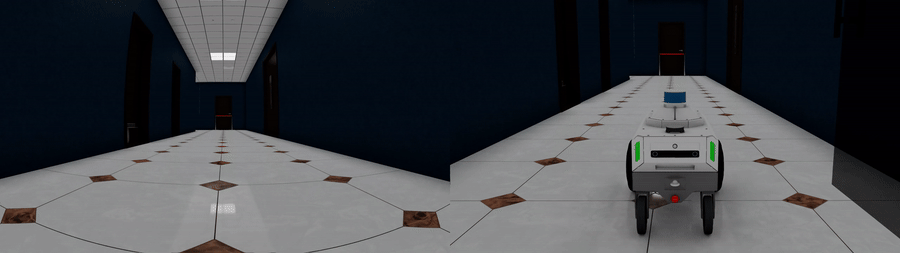

<div align="center">

# TIC-VLA Navigation Evaluation on DynaNav Benchmark

**Vision-Language-Action navigation with TIC-VLA in NVIDIA Isaac Sim 5.0.0 — evaluated across 4 scenes × 2 robot platforms**

[]()
[]()
[]()
[]()



</div>

---

## 📋 目錄

- [專案概述](#專案概述)
- [評估結果](#評估結果)
- [示範影片](#示範影片)
- [系統需求](#系統需求)
- [安裝步驟](#安裝步驟)
- [資料集與模型權重](#資料集與模型權重)
- [執行評估](#執行評估)
- [本專案做的修正](#本專案做的修正)
- [故障排除](#故障排除)
- [Repo 結構](#repo-結構)
- [參考與致謝](#參考與致謝)

---

## 專案概述

本專案為 NTUST GIMT「Intelligent Manufacturing Systems」課程 HW0 Task 1 的實作：部署 [TIC-VLA](https://github.com/ucla-mobility/TIC-VLA)（一個處理延遲視覺語言語意的 VLA 導航模型）於 **NVIDIA Isaac Sim 5.0.0**，在 **DynaNav benchmark** 上進行閉環評估。

**評估設定**：4 個場景（醫院、辦公室、戶外街道、倉庫）× 2 種機器人平台（**Nova Carter** 輪式 / **Boston Dynamics Spot** 四足）= 8 episodes，場景中含動態行人（20–100 人）。模型以官方預訓練權重執行推論，即時輸出低階速度控制指令（線速度 / 角速度）。

**執行環境重點**：無螢幕（headless）Linux 伺服器、RTX 6000 Ada（48GB VRAM）、透過 NFS 的共享儲存——為此對官方程式碼做了數項適配修正（見[本專案做的修正](#本專案做的修正)）。

## 評估結果

以下為完整 8 集評估的最終成績（單一評估 run，2026-09-11 執行）。

| Episode | 平台 | 結果 | Nav. Error | 碰撞 | 時長 |
|---|---|---|---|---|---|
| hospital | Nova Carter | ✅ SUCCESS | 1.48 m | 無 | 18.7 s |
| office | Nova Carter | ✅ SUCCESS | 1.50 m | 無 | 20.6 s |
| outdoor | Nova Carter | ❌ Failed | 16.53 m | 無 | 100 s (timeout) |
| warehouse | Nova Carter | ❌ Failed | 24.02 m | 有 | 70 s (timeout) |
| hospital | Spot | ❌ Failed | 23.23 m | 有 | 90 s (timeout) |
| office | Spot | ✅ SUCCESS | 1.48 m | 無 | 21.1 s |
| outdoor | Spot | ⚠️ 未生成* | 17.04 m | 無 | 120 s (timeout) |
| warehouse | Spot | ❌ Failed | 5.61 m | 無 | 90 s (timeout) |

**彙總**：Success Rate **37.5%**（3/8）｜Avg. Navigation Error **11.36 m**｜Collision Rate **25%**

\* outdoor × Spot：機器人於此場景生成失敗（見[已知問題](#已知問題)），整集靜止至超時。

### 補充實驗：官方 full-config 路線重評估

為驗證戶外/倉庫的失敗是否源於路線設定，另以官方 `benchmark_full.yaml` 的對應路線（戶外 100 名行人、時限 200–250s）重評估該 4 集：4 集皆失敗（平均 NE 28.85 m），顯示這兩個場景對模型本身即為高難度；其中 outdoor × Spot 的生成失敗於本輪**再次出現**（2/2）。

### 已知問題

1. **Spot × Outdoor 場景：機器人生成失敗（出現 2/2 次）**——該集 log 中無任何場景/機器人設置完成的訊息，行為腳本未啟動、無相機影像輸出、模擬空轉至超時。同場景下 Nova Carter 可正常生成執行；同平台 Spot 於其他三場景均正常。
2. **戶外場景存在上游資產缺失**——本地 `outdoorss.usd` 無法載入，多個雲端植被資產（樹木、灌木）404。可能影響兩平台於該場景的感知品質，為戶外表現偏弱的因素之一。

**運算資源紀錄**：NVIDIA RTX 6000 Ada（48 GB）單卡；峰值 VRAM 約 10–12 GB（室內場景）/ 約 45 GB（戶外場景，100 名行人）；單集實際執行時間約 20–40 分鐘（含 Isaac Sim 子行程啟動；首次執行另需下載雲端資產與編譯 shader）；隨機種子 seed=36（見 config）。

> 📌 觀察：(1) 兩平台在相同場景的表現差異（如醫院：Carter 成功 / Spot 失敗）反映了相機視角高度對 VLM 語意理解的影響；(2) 戶外街道為最難場景，官方 benchmark 對其放寬 success threshold 至 4m；(3) warehouse_spot 機器狗無碰撞行走 48m，最終停在離目標 5.6m 處。

## 示範影片

每支影片為「左：機器人 RGB 視角｜右：第三人稱視角」並排，10 fps。

**影片不放在本 repo**，統一放雲端：[📁 Google Drive 影片資料夾](https://drive.google.com/drive/folders/1H4u4x5MQCqMlOlPKLGSqTH4yU5D35DUh?usp=sharing)

| 場景 | Nova Carter | Spot |
|---|---|---|
| Hospital | [▶ 觀看](https://drive.google.com/file/d/1IzxsUGkXSPMVKoo8KGXRhsGI4ZnxO6xS/view?usp=drive_link) | [▶ 觀看](https://drive.google.com/file/d/1ZAWNkM8ShNFTSQ63AODS8aJtWso-qmlM/view?usp=drive_link) |
| Office | [▶ 觀看](https://drive.google.com/file/d/1w84Jub34wGmuWx3Wt-GP2pV0dX7nzeNE/view?usp=drive_link) | [▶ 觀看](https://drive.google.com/file/d/1NzdpA_rsLKailVPmF55pm6s6Hj1rI8eq/view?usp=drive_link) |
| Outdoor | [▶ 觀看](https://drive.google.com/file/d/13HXdLCR3r7xzTMLAgOl5YKSS6t4iG3wZ/view?usp=drive_link) | N/A（見[已知問題](#已知問題)） |
| Warehouse | [▶ 觀看](https://drive.google.com/file/d/1QeuMe2_utzj0-p37cUBpXeHKhfjgpAow/view?usp=drive_link) | [▶ 觀看](https://drive.google.com/file/d/1Kdge-4mRsOE1iBmmkubvkb29nAlvE4G9/view?usp=drive_link) |

## 系統需求

| 項目 | 需求 |
|---|---|
| 作業系統 | Ubuntu 22.04（GLIBC ≥ 2.34；**20.04 無法執行 Isaac Sim 5.0**） |
| GPU | NVIDIA，**VRAM ≥ 24 GB**（本專案使用 RTX 6000 Ada 48GB） |
| 驅動 | NVIDIA Driver ≥ 535（本專案 580.173） |
| 磁碟 | ≥ 250 GB 可用（Isaac Sim ~15GB、DynaNav 資料 ~103GB、快取與輸出） |
| 其他 | Miniconda、Git；無需實體螢幕（全程 headless） |

## 安裝步驟

### 1. Isaac Sim 5.0.0

```bash
wget https://download.isaacsim.omniverse.nvidia.com/isaac-sim-standalone-5.0.0-linux-x86_64.zip
unzip -q isaac-sim-standalone-5.0.0-linux-x86_64.zip -d <安裝路徑>/isaacsim
cd <安裝路徑>/isaacsim && ./post_install.sh
```

### 2. 取得本 repo

本 repo 的 `task1/` 目錄即上游 [TIC-VLA](https://github.com/ucla-mobility/TIC-VLA) 的完整程式碼**加上本專案的全部修正**——clone 一次即可重現評估：

```bash
git clone https://github.com/111360117year/IMS-HW0-TICVLA-DynaNav.git
cd IMS-HW0-TICVLA-DynaNav/task1
```

### 3. Conda 環境

```bash
conda env create -f tic-vla.yaml
conda activate tic-vla
pip install -e .
```

### 4. Isaac Sim 內建 Python 的額外依賴

benchmark 由 Isaac Sim 自帶的 Python 執行，需另行安裝模型依賴：

```bash
<isaacsim路徑>/python.sh -m pip install --no-cache-dir transformers==4.57.6 timm einops accelerate safetensors
```

## 資料集與模型權重

**皆不隨 repo 提供**（遵守作業規範），請自行下載（以下指令於 `task1/` 目錄內執行）：

```bash
# 模型權重（~4 GB）：TIC-VLA checkpoint + InternVL3-1B base model
python - <<'PY'
from huggingface_hub import hf_hub_download, snapshot_download
hf_hub_download(repo_id="handsomeYun/TIC-VLA", repo_type="dataset",
                filename="TIC-VLA-model.ckpt", local_dir="checkpoints")
snapshot_download(repo_id="OpenGVLab/InternVL3-1B", repo_type="model",
                  local_dir="checkpoints/internvl3-1b")
PY

# DynaNav benchmark 資料（zip ~103 GB，解壓後 ~97 GB；只需 DynaNav 子集，勿下載整包 538GB）
python - <<'PY'
from huggingface_hub import snapshot_download
snapshot_download(repo_id="handsomeYun/TIC-VLA", repo_type="dataset",
                  allow_patterns=["DynaNav/*"], local_dir="data")
PY
cd data/DynaNav && unzip -q DynaNav_data.zip && unzip -q DynaNav_json.zip
```

### 環境變數設定（`.env.testing`）

```bash
export ISAAC_SIM_ROOT=<isaacsim路徑>
export ISAAC_SIM_PYTHON=$ISAAC_SIM_ROOT/python.sh
export TICVLA_CHECKPOINT_PATH=<路徑>/checkpoints/TIC-VLA-model.ckpt
export TICVLA_BASE_MODEL_PATH=<路徑>/checkpoints/internvl3-1b   # Spot 平台必需
export TICVLA_DYNANAV_ROOT=<repo路徑>/task1/DynaNav
export CUDA_VISIBLE_DEVICES=0
```

## 執行評估

```bash
cd <repo路徑>/task1
source .env.testing

# 完整 8 集評估（4 場景 × 2 平台）
DynaNav/run_benchmark.sh DynaNav/configs/benchmark_hw0.yaml

# 結果輸出於 DynaNav/benchmark_results/<run_id>/：彙總指標（SR、NE、碰撞率、SPL）與逐集明細
```

每個 episode 於獨立 Isaac Sim 子行程執行；首次執行需下載雲端場景資產與編譯 shader（較慢），之後有快取。終端機即時顯示 VLM 推論輸出與速度指令。

### 影片合成

評估過程中兩路相機影像存於 `DynaNav/logs/<run_id>/`（每集獨立資料夾）。合成並排影片：

```bash
ffmpeg -framerate 10 -pattern_type glob -i 'front_frame_*.jpg' \
       -framerate 10 -pattern_type glob -i 'tp_frame_*.jpg' \
       -filter_complex "[0:v]scale=-2:720[l];[1:v]scale=-2:720[r];[l][r]hstack[v]" \
       -map "[v]" -c:v libx264 -pix_fmt yuv420p -shortest <輸出>.mp4
# Spot 平台的 RGB 視角檔名為 head_frame_*.jpg
```

## 本專案做的修正

在無螢幕伺服器上復現時，對官方程式碼做了以下修正（也是本 repo 與上游的差異）：

| # | 問題 | 修正 |
|---|---|---|
| 1 | `benchmark.py` 預設 `headless: False`，在無螢幕伺服器上整個模擬凍結於渲染拷貝節點（GPU 0%、log 停在 `OgnSdPostRenderVarToHost`） | `APP_CONFIG` 改為 `{"headless": True, "multi_gpu": False, ...}` |
| 2 | Isaac Sim 內建 Python 缺模型依賴（`No module named 'transformers'`），模型無法載入、機器人原地不動 | 於 `python.sh -m pip` 安裝 transformers 等（見安裝步驟 4） |
| 3 | Spot 行為腳本讀取 `TICVLA_BASE_MODEL_PATH` 環境變數（未設定則以 HF repo 名當本地路徑而失敗，Spot 站立不動） | 於 `.env.testing` 設定該變數指向本地 InternVL3-1B |
| 4 | 官方 `benchmark_example.yaml` 多個 episode 的 `start_yaw` 與「起點→目標方位角」相差約 180°（機器人出生即背對目標，如 office：config +90 vs 實際 -78）——以方位角計算驗證並修正後，office 集由 NE 40m 失敗變為 NE 1.5m 成功 | `benchmark_hw0.yaml` 中各 episode 之 yaw 依官方 `benchmark_full.yaml` 驗證後設定 |
| 5 | 影像緩衝目錄位於 NFS，模擬主迴圈同步寫入曾致 NFS D-state 凍結；且多集共用資料夾互相覆蓋 | `logs/` symlink 至本機磁碟；影像資料夾名附加行程 PID（每集獨立） |
| 6 | 模型輸入影像用後即刪，無法產出作業要求的 RGB 視角影片 | 保留全部影格（`os.remove` → no-op） |

## 故障排除

| 症狀 | 原因與解法 |
|---|---|
| 啟動後模型載入完成即全面靜止、GPU 0% | 見修正 #1（headless 設定） |
| `ImportError: TICVLA is None` | 見修正 #2（Isaac Python 缺依賴） |
| Spot 整集原地不動（path < 2m） | 見修正 #3（`TICVLA_BASE_MODEL_PATH`） |
| 機器人筆直走向反方向 | 見修正 #4（yaw 驗證：`atan2(dy, dx)` 對照 config） |
| 行程進入 `D` 狀態、log 停滯 | NFS I/O 懸置——影像目錄改本機磁碟（修正 #5）；等待或砍掉重跑 |
| GLIBC 錯誤 | 作業系統過舊，需 Ubuntu 22.04+ |

## Repo 結構

```
IMS-HW0-TICVLA-DynaNav/
├── README.md                        # 兩任務索引（repo 根目錄）
├── task1/                           # ← 本任務（TIC-VLA + DynaNav）
│   ├── README.md                    # 本文件
│   ├── .env.testing                 # 環境變數範本
│   ├── tic-vla.yaml                 # conda 環境定義
│   ├── docs/demo.gif                # 示範 GIF
│   ├── DynaNav/
│   │   ├── benchmark.py             # 修正 #1
│   │   ├── run_benchmark.sh
│   │   ├── behavior/
│   │   │   ├── nova_carter_test_ticvla.py   # 修正 #5、#6
│   │   │   └── spot_test_ticvla.py          # 修正 #3、#5、#6
│   │   ├── configs/
│   │   │   ├── benchmark_hw0.yaml   # 本專案的 8 集評估設定（修正 #4）
│   │   │   ├── rerun_hard4.yaml     # 戶外/倉庫官方路線重評估
│   │   │   └── ...
│   │   └── assets/                  # 場景檔（office、outdoor）
│   ├── ticvla/                      # 模型程式碼（上游）
│   └── ...                          # 其餘上游 TIC-VLA 檔案
└── task2/                           # HW0 Task 2（SmolVLA + LIBERO）
```

## 參考與致謝

- [TIC-VLA](https://github.com/ucla-mobility/TIC-VLA)（UCLA Mobility Lab）— 模型與 DynaNav benchmark
- [InternVL3-1B](https://huggingface.co/OpenGVLab/InternVL3-1B)（OpenGVLab）— VLM base model
- [NVIDIA Isaac Sim](https://developer.nvidia.com/isaac-sim) — 模擬平台
- NTUST GIMT「Intelligent Manufacturing Systems」（Fall 2026, Prof. Sin-Ye Jhong）— 課程作業框架

**作者**：【學號待填】（[@111360117year](https://github.com/111360117year)）
