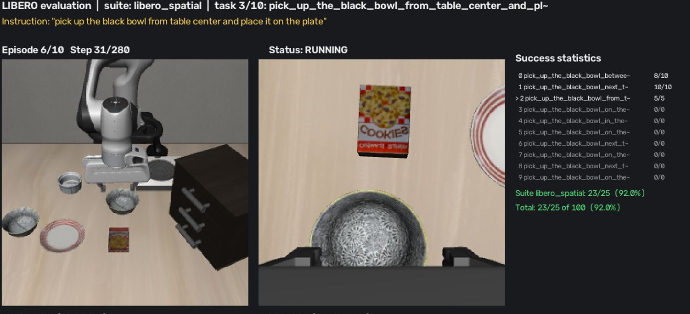

<div align="center">

# SmolVLA Reproduction on LIBERO with LeRobot

**以 LeRobot 訓練 SmolVLA（0.45B）並在 LIBERO 四個套件（400 episodes）上評估，附自製 live view 視窗**

[]()
[]()
[]()
[]()



</div>

---

## 📋 目錄

- [專案概述](#專案概述)
- [評估結果](#評估結果)
- [Live view 視窗](#live-view-視窗)
- [繳交物](#繳交物)
- [系統需求](#系統需求)
- [安裝步驟](#安裝步驟)
- [資料集](#資料集)
- [訓練](#訓練)
- [執行評估](#執行評估)
- [注意事項](#注意事項)
- [Repo 結構](#repo-結構)
- [參考與致謝](#參考與致謝)

---

## 專案概述

本專案為 NTUST GIMT「Intelligent Manufacturing Systems」課程 HW0 Task 2 的實作：以 [LeRobot](https://github.com/huggingface/lerobot) 官方流程訓練 [SmolVLA](https://arxiv.org/abs/2506.01844)（0.45B）於 LIBERO 資料集，並在 **LIBERO-Spatial / Object / Goal / Long** 四個套件上以「每套件 10 個任務 × 每任務 10 集」共 400 集進行評估，與論文 Table 2 的成績比較。

**模型**：SmolVLM2-500M 視覺語言骨幹（取前 16 層、凍結）＋ 從零訓練的約 1 億參數動作專家，總參數 450,046,176。僅以 VLM 權重初始化，未使用任何 SmolVLA 預訓練 checkpoint，與論文 LIBERO 實驗的設定相同。

**執行環境**：無螢幕 Linux 伺服器、RTX 6000 Ada（48 GB）、NFS 共享儲存。

## 評估結果

繳交的 checkpoint 為第二次訓練（v2）的第 90,000 步，評估設定：seed 1000、每任務 10 集、`n_action_steps=10`。

| 套件 | 論文 | 本專案 | 差距 | ±3 pp 內 |
|---|---|---|---|---|
| LIBERO-Spatial | 90.0 | 86.0 | −4.0 | ❌ |
| LIBERO-Object | 96.0 | **98.0** | +2.0 | ✅ |
| LIBERO-Goal | 92.0 | **95.0** | +3.0 | ✅ |
| LIBERO-Long | 71.0 | **71.0** | 0.0 | ✅ |
| **平均** | **87.3** | **87.5** | +0.2 | |

### 兩次訓練與各 checkpoint 的成績

本專案共訓練兩次，所有 checkpoint 皆以相同協議評估：

- **v1**：LeRobot 官方 LIBERO 配方原樣執行。其學習率排程預設於第 30,000 步即衰減至最低值，其後 70,000 步幾乎不再學習，成績在 70k 達到高點後下降。
- **v2（繳交）**：唯一的改動是把餘弦衰減拉長到整個訓練（`--policy.scheduler_decay_steps=100000`），其餘配方相同。四個套件平均提升約 4 個百分點，Long 由 65 提升至 71。

| 訓練 | Checkpoint | Spatial | Object | Goal | Long | 平均 |
|---|---|---|---|---|---|---|
| v1 | 50k | 80 | 90 | 91 | 61 | 80.5 |
| v1 | 60k | 80 | 86 | 85 | 68 | 79.8 |
| v1 | 70k | 91 | 94 | 85 | 65 | 83.8 |
| v1 | 80k | 81 | 93 | 85 | 66 | 81.2 |
| v1 | 100k | 82 | 89 | 87 | 58 | 79.0 |
| v2 | 70k | 85 | 94 | 89 | 76 | 86.0 |
| v2 | 80k | 88 | 96 | 96 | 78 | 89.5 |
| **v2** | **90k** | 86 | **98** | **95** | **71** | **87.5** |
| v2 | 100k | 86 | 91 | 94 | 70 | 85.2 |

v1 100k 的評估使用 `n_action_steps=1`，其餘為 10；兩種設定在 Spatial 上的成績相同（82 對 81）。

### 與論文的比較

v2 90k 的四套件平均 87.5 與論文的 87.3 相當，Object、Goal、Long 三個套件在 ±3 個百分點內，Spatial 低 4 個百分點。每套件 100 集的成功率標準差約 4 個百分點，1 個百分點即為 1 集。

以公開配方復現論文分數在社群中被廣泛回報為困難：LeRobot 官方釋出的 LIBERO checkpoint `lerobot/smolvla_libero` 以本專案相同的評估程式跑 Spatial 為 83%；GitHub issue [#3287](https://github.com/huggingface/lerobot/issues/3287)、[#2354](https://github.com/huggingface/lerobot/issues/2354)、[#1369](https://github.com/huggingface/lerobot/issues/1369)、[#4614](https://github.com/huggingface/lerobot/issues/4614) 以相同配方得到的成績均低於論文（如 #3287 的 83 / 70 / 70 / 44.8）。

**運算資源紀錄**：v1 於 RTX 6000 Ada 單卡、fp32，每步 0.76 秒，100,000 步共 22.5 小時，VRAM 約 14 GB；v2 於兩張 RTX 6000 Ada、bf16，每步 0.39 秒，100,000 步約 11 小時，每卡 VRAM 約 8 GB。評估每集 5–20 秒，一個套件 100 集約 15–25 分鐘。

## Live view 視窗

`eval_libero_liveview.py` 在評估時即時顯示（見上方截圖）：

- 前視相機（agentview）與腕部相機（eye-in-hand）
- 任務套件、任務名稱與語言指令
- 目前 episode、步數 / 步數上限、狀態（RUNNING / SUCCESS / FAIL）
- 逐任務與全部的成功統計

視窗以 MJPEG 串流提供於 `http://127.0.0.1:8765/`，遠端伺服器時轉發該埠即可在瀏覽器觀看；每一集同時錄成 mp4，400 集錄影完整保留。終端機每集印一行結果，套件結束印彙總表：

```
[libero_long task  2/10 ep  1/10] SUCCESS steps 298/520   6.9s  |  task 1/1  suite 1/2  total 1/2/400
```

## 繳交物

| 項目 | 位置 |
|---|---|
| `pretrained_model/`（v2 checkpoint 90k：config.json、model.safetensors、processor 設定、train_config.json） | [Hugging Face 模型 repo](https://huggingface.co/kuneo/ims-hw0-smolvla-libero) |
| `eval_info.json`（四套件合併，400 集） | 同上，根目錄 |
| 400 集 live view 錄影（`videos/<suite>/taskXX_epYY_{SUCCESS,FAIL}.mp4`） | [Hugging Face 影片 repo](https://huggingface.co/datasets/kuneo/ims-hw0-smolvla-libero-videos) |
| 程式碼、Dockerfile、README | 本 repo `task2/` |

資料集、checkpoint 與影片皆不放在 GitHub。

## 系統需求

| 項目 | 需求 |
|---|---|
| 作業系統 | Linux（LIBERO 僅支援 Linux）；本專案 Ubuntu 22.04 |
| GPU | NVIDIA，訓練 VRAM ≥ 16 GB、評估 ≥ 4 GB（本專案 RTX 6000 Ada 48 GB） |
| 驅動 / CUDA | Driver ≥ 570、CUDA 12.8 |
| 磁碟 | ≥ 30 GB（資料集 1.9 GB、VLM 權重 1 GB、每個 checkpoint 約 2.6 GB、400 集錄影約 1 GB） |
| 其他 | Docker 或 Miniconda；無需實體螢幕 |

## 安裝步驟

### 方法 A：Docker

```bash
git clone https://github.com/111360117year/IMS-HW0-TICVLA-DynaNav.git
cd IMS-HW0-TICVLA-DynaNav/task2
docker build -t smolvla-libero .
docker run --gpus all -it --rm -p 8765:8765 -v /path/on/host/data:/data smolvla-libero
```

容器內 `HF_HOME=/data/hf_cache`，資料集、權重與輸出都放在掛載的 `/data`；8765 為 live view 埠。

### 方法 B：Conda

```bash
conda create -n lerobot python=3.10 -y && conda activate lerobot
pip install torch==2.10.0 torchvision==0.25.0 --index-url https://download.pytorch.org/whl/cu128
pip install "cmake>=3.29,<4"
pip install --no-build-isolation egl_probe hf-egl-probe
pip install "lerobot[libero,smolvla]==0.4.4"
export MUJOCO_GL=egl
```

LIBERO 第一次匯入會詢問 `Do you want to specify a custom path for the dataset folder? (Y/N)`，回答 `N`；第一次評估會自動下載 LIBERO 的場景資產。

## 資料集

使用 LeRobot 提供的 [`lerobot/libero`](https://huggingface.co/datasets/lerobot/libero)：1,693 集示範、273,465 幀、40 個任務、兩台 256×256 相機，與論文使用的 `physical-intelligence/libero` 為同一批示範。`lerobot-train` 第一次執行時自動下載至 `$HF_HOME/lerobot/lerobot/libero`，不需手動處理。

資料集版本固定為 `a1aaacb7f6cd6ee5fb43120f673cebb0cfea7dd4`。

## 訓練

依 LeRobot 官方 LIBERO 文件的 SmolVLA 配方：僅以 VLM 初始化、凍結 VLM 只訓練動作專家、chunk size 50、影像縮放至 512×512、AdamW（β 0.9 / 0.95）、學習率 1e-4 餘弦衰減至 2.5e-6，**100,000 步、有效 batch size 64**，每 10,000 步存一個 checkpoint。繳交的 v2 將餘弦衰減設定為橫跨全部 100,000 步（`--policy.scheduler_decay_steps=100000`），並以兩張 GPU、bf16 混合精度訓練（每卡 batch 32）。

```bash
NCCL_P2P_DISABLE=1 NCCL_IB_DISABLE=1 CUDA_VISIBLE_DEVICES=0,1 \
accelerate launch --multi_gpu --num_processes=2 --mixed_precision=bf16 $(which lerobot-train) \
  --policy.type=smolvla \
  --policy.load_vlm_weights=true \
  --policy.push_to_hub=false \
  --policy.scheduler_decay_steps=100000 \
  --dataset.repo_id=lerobot/libero \
  --dataset.revision=a1aaacb7f6cd6ee5fb43120f673cebb0cfea7dd4 \
  --dataset.video_backend=pyav \
  --output_dir=outputs/train_smolvla_libero_v2 \
  --steps=100000 \
  --batch_size=32 \
  --save_freq=10000 \
  --policy.device=cuda \
  --wandb.enable=false
```

單卡執行時改為 `lerobot-train ... --batch_size=64`，其餘參數相同（v1 即以此方式訓練，但未加 `--policy.scheduler_decay_steps`）。Checkpoint 位於 `outputs/train_smolvla_libero_v2/checkpoints/<step>/pretrained_model`。中斷後續跑：

```bash
accelerate launch --multi_gpu --num_processes=2 --mixed_precision=bf16 $(which lerobot-train) \
  --config_path=outputs/train_smolvla_libero_v2/checkpoints/last/pretrained_model/train_config.json --resume=true
```

## 執行評估

評估協議：每套件 10 個任務、每任務 10 集，LIBERO 固定初始狀態，seed 1000，flow matching 10 步，`n_action_steps=10`，觀測解析度 256×256，步數上限 Spatial / Object 280、Goal 300、Long 520。

LeRobot 內部以 `libero_10` 代表 LIBERO-Long，`--env.task` 須填 `libero_10`；本專案的輸出目錄、log 與 `eval_info.json` 一律以 `libero_long` 命名。

### 單一套件

```bash
python eval_libero_liveview.py \
  --policy.path=outputs/train_smolvla_libero_v2/checkpoints/090000/pretrained_model \
  --policy.n_action_steps=10 \
  --env.type=libero --env.task=libero_10 \
  --env.observation_height=256 --env.observation_width=256 \
  --eval.n_episodes=10 --eval.batch_size=1 --seed=1000 \
  --output_dir=outputs/eval_v2_ckpt90k/libero_long \
  --liveview.port=8765
```

### 四套件全部（400 集）並合併結果

```bash
N_ACTION_STEPS=10 SEED=1000 ./run_eval_all.sh \
  outputs/train_smolvla_libero_v2/checkpoints/090000/pretrained_model outputs/eval_v2_ckpt90k 0,1,2,3
```

最後一個參數為 GPU 編號：給一張卡則四個套件依序執行，給四張卡則平行執行。輸出：

```
outputs/eval_v2_ckpt90k/<suite>/eval_info.json                         各套件結果
outputs/eval_v2_ckpt90k/<suite>/videos/<suite>/taskXX_epYY_{SUCCESS,FAIL}.mp4   每集 live view 錄影
outputs/eval_v2_ckpt90k/eval_info.json                                 四套件合併結果
```

### Live demo（LIBERO-Long 10 個任務 × 1 集）

```bash
python eval_libero_liveview.py \
  --policy.path=outputs/train_smolvla_libero_v2/checkpoints/090000/pretrained_model \
  --policy.n_action_steps=10 \
  --env.type=libero --env.task=libero_10 \
  --env.observation_height=256 --env.observation_width=256 \
  --eval.n_episodes=1 --eval.batch_size=1 --seed=1000 \
  --output_dir=outputs/demo_libero_long \
  --liveview.port=8765
```

執行後在瀏覽器開啟 `http://localhost:8765`（遠端伺服器需先轉發 8765 埠）。

## 注意事項

| 狀況 | 處理 |
|---|---|
| `egl_probe` 編譯失敗 | 安裝 `cmake<4`，並以 `pip install --no-build-isolation egl_probe hf-egl-probe` 安裝 |
| 無螢幕伺服器上 MuJoCo / EGL 錯誤 | 設定 `export MUJOCO_GL=egl` |
| 以 `nohup` 執行時評估卡在開頭 | LIBERO 首次匯入的互動問答在等待輸入；先互動執行一次回答 `N`，或如 Dockerfile 預先建立 `~/.libero/config.yaml` |
| 評估 `lerobot/smolvla_libero` 或自 `smolvla_base` 微調的模型 | 需加 `--rename_map='{"observation.images.image": "observation.images.camera1", "observation.images.image2": "observation.images.camera2"}'` |
| 相機方向 | LeRobot 的 LIBERO 前處理已將兩台相機影像旋轉 180°，與訓練資料一致，不需再翻轉 |

## Repo 結構

```
task2/
├── eval_libero_liveview.py   # 評估程式：live view、每集錄影、eval_info.json
├── run_eval_all.sh           # 四套件評估與合併
├── merge_eval_info.py        # 合併各套件 eval_info.json 並與論文對照
├── Dockerfile                # CUDA 12.8 + PyTorch 2.10 + LeRobot 0.4.4 + LIBERO
├── docs/liveview.png         # live view 截圖
└── README.md
```

## 參考與致謝

- [SmolVLA: A Vision-Language-Action Model for Affordable and Efficient Robotics](https://arxiv.org/abs/2506.01844)
- [LeRobot](https://github.com/huggingface/lerobot)（Hugging Face）— 訓練與評估框架、`lerobot/libero` 資料集
- [LIBERO](https://github.com/Lifelong-Robot-Learning/LIBERO) — benchmark
- NTUST GIMT「Intelligent Manufacturing Systems」（Fall 2026, Prof. Sin-Ye Jhong）— 課程作業框架

**作者**：M11502135 顧弘年（[@111360117year](https://github.com/111360117year)）
